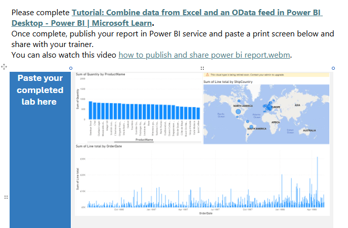

# 📊 Power BI Retail & Sales Analysis Project

## 📌 Project Overview

This project was completed as part of a **Data Technician Bootcamp** and focuses on analysing and visualising **retail and sales data using Power BI**. The goal was to clean and transform raw data, build interactive reports, and present insights through clear and engaging visualisations that support data-driven decision-making.

A strong emphasis was placed on **data storytelling**, ensuring insights are easy to interpret for both technical and non-technical users.

---

## 🛠️ Skills & Tools Used

### 🔄 Data Transformation & Cleaning (Power Query)

* Imported and prepared retail and sales datasets
* Cleaned data by:

  * Removing errors and duplicates
  * Renaming and restructuring columns
  * Changing data types for accuracy
* Created a reliable data model ready for analysis

---

### 🧮 DAX Calculations

* Built **calculated columns and measures** using DAX to:

  * Calculate total and average sales
  * Analyse performance over time
  * Support deeper insights across reports

---

### 📈 Data Visualisation

Created a range of visualisations to explore and communicate insights:

* **Bar charts** for product and category comparisons
* **Line charts** to show sales trends over time
* **Pie charts** to illustrate proportions and contributions
* **Maps** to visualise sales performance by location

---

### 🎛️ Interactivity & Reporting

* Designed **interactive reports** with:

  * Slicers and filters for time periods, categories, and regions
  * Cross-filtering between visuals for deeper exploration
* Structured report pages with clear layouts and consistent formatting

---

## 🧠 Data Storytelling

The reports were designed to guide users through the data by:

* Highlighting key trends and patterns in retail performance
* Allowing users to interact with the data and answer their own questions
* Presenting insights in a clear, logical, and visually engaging way

---

## 📂 Dataset

* Retail and sales data including:

  * Dates and time periods
  * Products and categories
  * Geographic information
  * Sales and performance metrics

---

## 🎯 Key Outcomes

* Developed practical Power BI skills relevant to entry-level data roles
* Gained experience transforming raw data into meaningful insights
* Improved confidence in building interactive, insight-driven reports

---

---

📌 *This project demonstrates hands-on experience with Power BI, showcasing data cleaning, DAX calculations, interactive reporting, and data storytelling using retail and sales data.*
